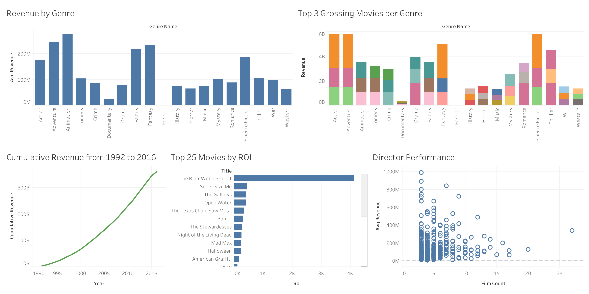
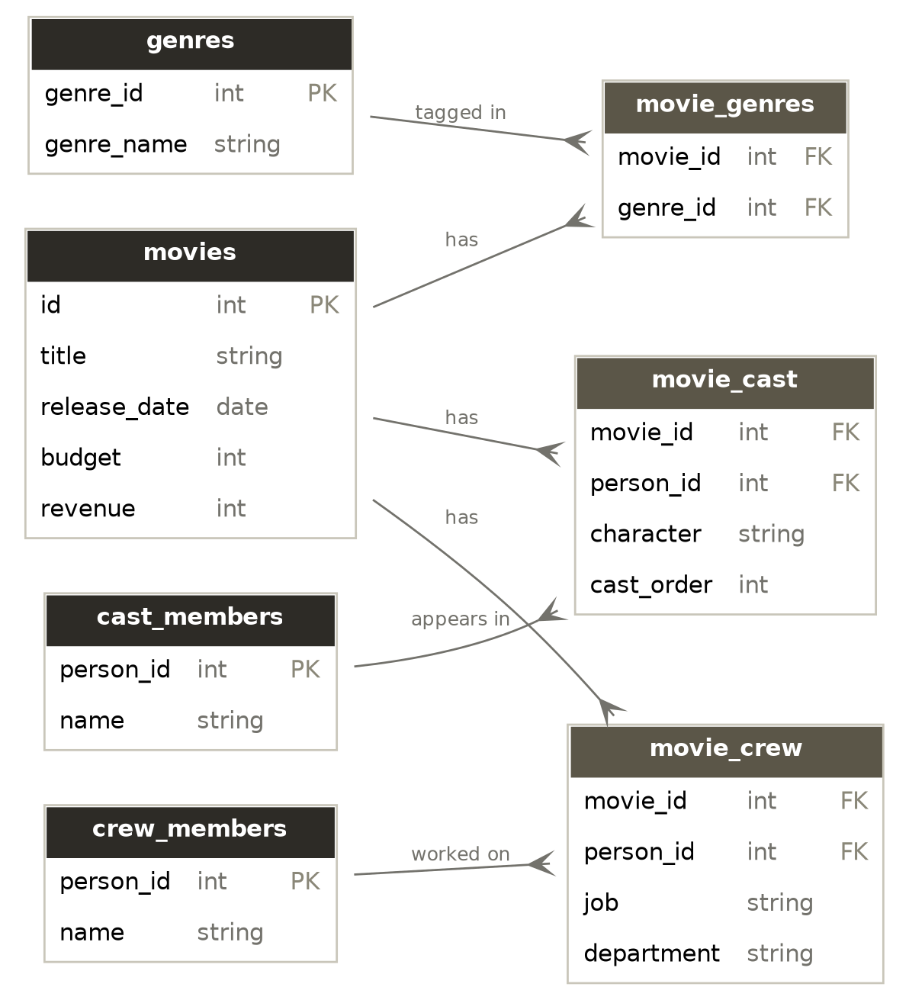

# Movie Industry SQL Analysis

An end-to-end SQL analytics project exploring the [TMDB 5000 Movie Dataset](https://www.kaggle.com/datasets/tmdb/tmdb-movie-metadata) — covering genre profitability, return on investment, director performance, and revenue trends over time. Includes a normalized relational schema built from raw nested JSON, advanced SQL (window functions, CTEs, multi-table joins), and a published interactive Tableau dashboard.

[**View the live dashboard on Tableau Public →**](https://public.tableau.com/views/MovieIndustryAnalysis_17888479348870/MovieIndustryAnalysisGenreROIDirectorPerformance?:language=en-US&publish=yes&:sid=&:redirect=auth&:display_count=n&:origin=viz_share_link)  



---

## Tools & Tech

- **Python** (pandas, SQLAlchemy) — data loading and transformation  
- **SQLite** — database  
- **SQL** — window functions, CTEs, multi-table joins, aggregate filtering  
- **Tableau Public** — dashboard and visualization  
- **Kaggle API** (`kagglehub`) — data sourcing

---

## Schema

Raw genre, cast, and crew data came from the source CSVs as nested JSON-like strings inside single columns (e.g. `genres: "[{'id': 28, 'name': 'Action'}, ...]"`). This isn't queryable relationally, so I parsed and normalized it into a proper relational schema with join tables to support many-to-many relationships (one movie has many genres; one genre applies to many movies; same for cast and crew).  



**Tables:**

- `movies` — core movie data (title, budget, revenue, release date, ratings)  
- `genres` / `movie_genres` — genre lookup \+ movie-genre join table  
- `cast_members` / `movie_cast` — actor lookup \+ movie-cast join table (includes character name, billing order)  
- `crew_members` / `movie_crew` — crew lookup \+ movie-crew join table (includes job, department)

---

## Key Findings

### 1\. Animation and Adventure films earn the most — Foreign and Documentary the least, by a huge margin

Animation tops the genre list at an average of **$276.5M** per film, narrowly ahead of Adventure ($244.2M) and Fantasy ($233.6M). At the other end, Documentary ($23.0M) and Foreign ($2.07M) films average dramatically less — Animation earns over **130x** what the average Foreign film does. This tracks with production/distribution scale, but the size of the gap was bigger than expected. → [`queries/revenue_by_genre.sql`](http://queries/revenue_by_genre.sql)

### 2\. Low-budget films can dramatically outperform blockbusters on ROI

Ranking movies by return on investment (revenue ÷ budget) surfaces a very different list than ranking by raw profit. *The Blair Witch Project* tops the list at a **4,133x** return on its $60K budget, followed by *Super Size Me* (440x) and *The Gallows* (427x) — all low-budget horror/documentary films that vastly outperformed big-budget releases on a dollar-for-dollar basis. → [`queries/top_roi_movies_min_budget_20k.sql`](http://queries/top_roi_movies.sql)

### 3\. The highest-earning director isn't the most prolific one

Among directors with 3+ films, **Joss Whedon** has the highest average revenue per film at **$987.9M** — despite directing only 3 films, driven by the Avengers movies. By contrast, **Steven Spielberg** is the most prolific director in the dataset with 27 films, but averages a comparatively modest $338.8M per film. This highlights a real tradeoff: a small number of guaranteed blockbusters can out-earn a large, more varied filmography on a per-film basis. → [`queries/director_performance.sql`](http://queries/director_performance.sql)

### 4\. Industry revenue in this dataset grew roughly 6x from the early 1990s to its peak

Total yearly revenue grew from $3.76B in 1992 to a peak of $22.8B in 2015 — about a 6x increase — with cumulative revenue crossing the $100B mark around 2003 and reaching $361B by the end of the dataset. Note: 2016 shows an apparent sharp drop, which is almost certainly a data-completeness artifact (the dataset appears to have been compiled before a full year of 2016 releases were available) rather than a genuine decline. → [`queries/cumulative_revenue.sql`](http://queries/cumulative_revenue.sql)

---

## Project Structure

```
├── queries/            # All final SQL queries, one file per analysis question
├── exports/            # CSV exports of query results, feeding the Tableau dashboard
├── analysis.py         # Runs any query file against the database (python analysis.py <file>.sql)
├── clean_data.py       # Parses nested JSON columns into normalized relational tables
├── download_data.py    # Downloads data locally
├── load_data.py        # Downloads TMDB data via Kaggle API and loads raw tables
├── export.py           # Batch-runs key queries and exports results to CSV for Tableau
├── eda.ipynb            # Jupyter Notebook to visually explore the tables
└── project.db           # SQLite database
```

---

## Future Improvements

- Normalize the remaining nested fields (`keywords`, `production_companies`) for deeper analysis  
- Add a runtime-adjusted profitability metric (revenue per minute)  
- Automate the load → clean → export pipeline into a single script  
- Migrate to PostgreSQL for a more production-representative setup
